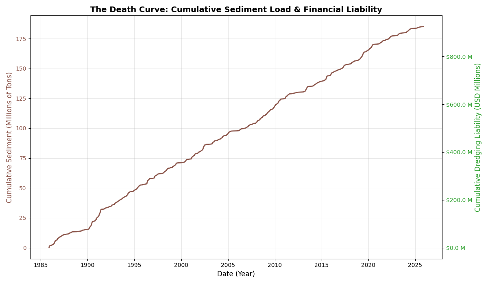

# Reservoir Sedimentation Audit & Financial Risk Assessment

### 🚨 Mission Objective
To quantify the cumulative financial liability of reservoir sedimentation using historical hydrological data.

### 📉 The "Death Curve"


### 🛠️ Tech Stack
*   **Engine:** Python 3.10+
*   **Data Processing:** Pandas, NumPy
*   **Modeling:** Scikit-Learn (Log-Log Regression for imputation)
*   **Storage:** SQLite (Local Vault)
*   **Visualization:** Matplotlib

### ⚙️ Engineering Logic
1.  **Ingestion:** Parsed raw USGS RDB (Tab-separated) format.
2.  **Imputation:** Validated a **Power Law relationship** ($Sediment = a \cdot Flow^b$) between Discharge and Sediment Concentration. Used Log-Log Linear Regression to impute 35% missing data (RMSE: ~2.03 Log Units).
3.  **Financial Analysis:** Calculated cumulative liability based on a dredging cost of **$5.00/ton**.

### 🚀 How to Run
1.  Clone the repository.
2.  Install dependencies:
    ```bash
    pip install -r requirements.txt
    ```
3.  Execute the pipeline:
    ```bash
    python src/main.py
    ```

### 📊 Results
*   **Total Sediment Load (1985-2024):** ~180 Million Tons
*   **Accrued Financial Liability:** **$924.9 Million USD**

### 📂 Data Provenance
*   **Source:** USGS National Water Information System (NWIS)
*   **Station:** ILLINOIS RIVER AT VALLEY CITY, IL (USGS 05586100)
*   **Retrieval Date:** 025-11-19 06:06:12 EST
*   **Parameters:** Discharge (00060) and Suspended Sediment (80154)
